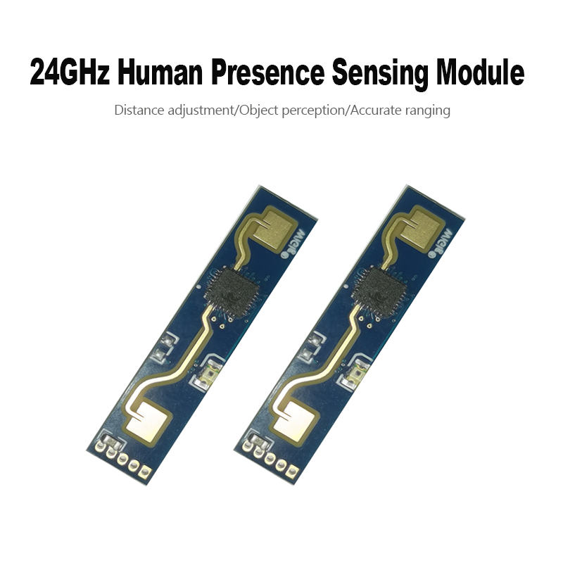
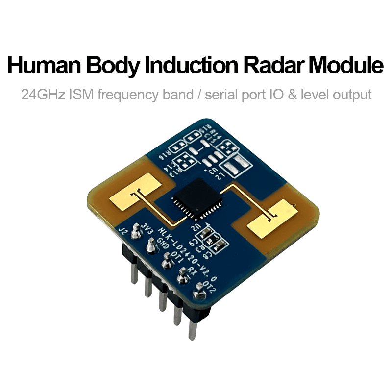
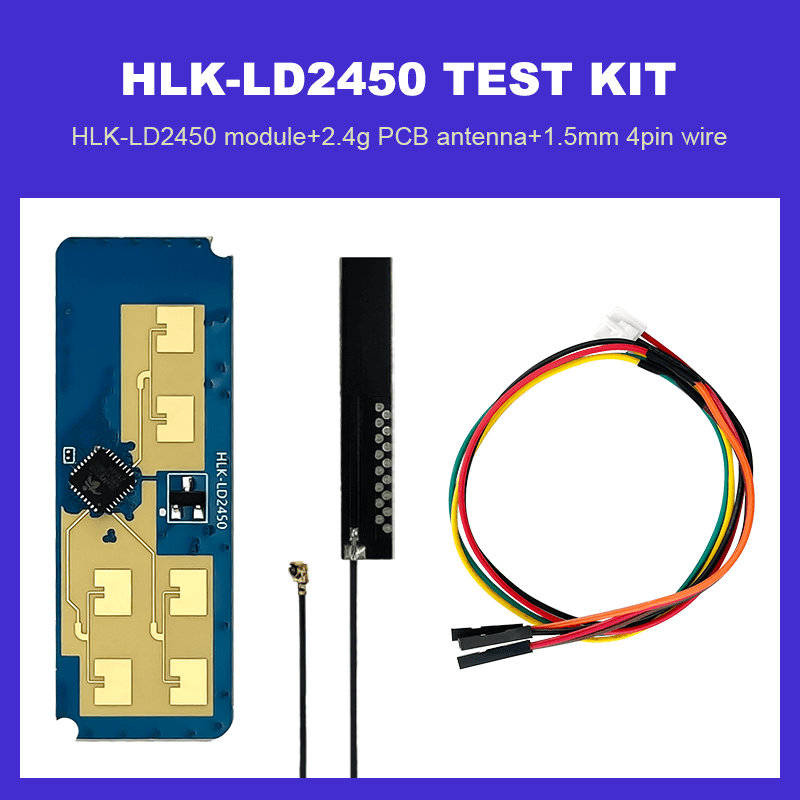
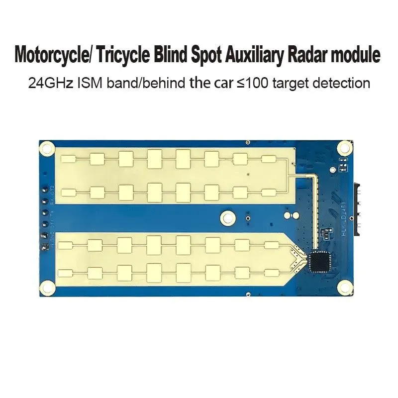
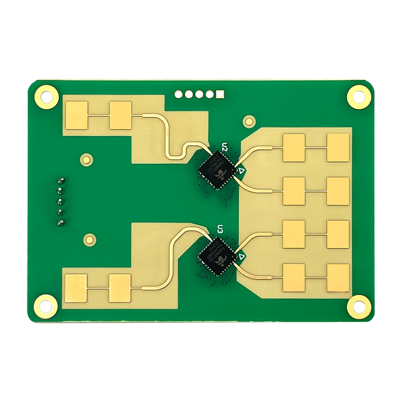

# eines vor weg alles was ich so gefunden habe im Netz oder hier in Github oder im Forum, alles ungetestet

hier will ich das Sensoren auflisten und das was ich brauce um sie zu nutzen. 
Radar und Clima Sensoren sind geplant

ENS160 + AHT21 Sensor for Arduino, gefunden https://www.instructables.com/ENS160-AHT21-Sensor-for-Arduino/

# Hi-Link mmWave Radar For ESPHome
Suggest used ESP-IDF framework to improve efficiency and stabilized.   
If using Arduino Framework, disconnect the UART cable might cause API error(disconnect).
## Plan to Support:
:white_check_mark: LD1115H UART/GPIO output, UART with sensitivity adjustable >[Link](./sensoren/radar/LD1115H)    
:white_check_mark: LD1125H UART output, UART with sensitivity adjustable >[Link](./sensoren/radar/LD1115H)     
:white_check_mark: LD112 GPIO output without adjustable >[Link](./sensoren/radar/LD112)  
:white_check_mark: LD017 IIC/GPIO output, IIC/GPIO for sensitivity adjustable >[Link](./sensoren/radar/LD017)     
:negative_squared_cross_mark: LD016 GPIO output, UART for sensitivity adjustable   
:white_check_mark: LD012 GPIO output with sensitivity adjustable pins >[Link](./sensoren/radar/LD012)  
:o: LD6001   
:o: LD7903A   

Code at each Radar Folder   
Note: Don't use 5V on LD017, LD012, LD2420   

### Similar Device:
LD2410 = LD2410B = LD2410C   
CEM5825F = LD1125H   
CEM5855H = LD1115H   

## work on Plan to Support:   
[HLK-LD2410](sensoren/radar/LD2410/README.md): 24GHz ESPHome Official Support Already
Es gibt noch weiter Versionen!!! Später [hlk]

---

[HLK-LD2420](sensoren/radar/LD2420): 24GHz, ? Traget, 8m 

ESPHome Official Support Already

---

[HLK-LD2450](sensoren/radar/LD2450/README.md): 24GHz, 3 Target, 7.5 m, 1T2R   

hier noch eine andere Quelle und weitere Codes: https://github.com/0ingchun/arduino-lib_HLK-LD2450_Radar/

---

[HLK-LD2451](sensoren/radar/LD2451/README.md): 24GHz, 100m Motorrad 

---

[HLK-LD2461](sensoren/radar/LD2461/README.md): 24GHz, 6-9 Target, 8m, 2T4R  

---  
  
LD6001A

HLK-LD6002C : 57–64 GHz,

ADT6101P -Chip

---

HLK-LD2415H : 24,125 GHz, 180m Car, 9-24 volt, K-Band

https://hlktech.net/index.php?id=1219

---
https://www.yourcee.online/collections/radar-sensor-rb98?spm=..index.header_1.1

Rd-03E: 24 GHz , 6m,

Rd-03D: 24GHz

Modell
Rd-03D
Paket
Standard-Buchsenstecker 1 x 4P-1,25 mm
Größe
15,0 x 44,0 (±0,2) mm
Antenne
On-Board-PCB-Antenne
Frequenz
24G ~24,25GHz
Arbeitstemperatur
-40℃ ~ 85℃
Lagertemperatur
-40℃ ~ 125℃, < 90% relative Luftfeuchtigkeit
Stromversorgung
Unterstützte Spannung 5 V, Versorgungsstrom ≥ 200 mA
Schnittstelle UART
UART-Rate Standard 256000 bps

---

03E Ranging Firmwar

03E Identify Firmwar

---

Hb100 : 10.525 GHz, 20m 

code:

#define SENSOR_PIN 2 // Define the pin connected to the OUT pin of the module
#define SAMPLING_INTERVAL 1000 // Define the sampling interval in milliseconds

unsigned long lastSampleTime = 0; // Variable to store the time of the last sampling
int motionDetected = 0; // Variable to store the detection status

void setup() {
  Serial.begin(9600); // Initialize the serial communication for debugging
  pinMode(SENSOR_PIN, INPUT); // Set the sensor pin as input
}

void loop() {
  if (millis() - lastSampleTime >= SAMPLING_INTERVAL) { // Check if it's time to take a new sample
    lastSampleTime = millis(); // Update the time of the last sampling
    motionDetected = digitalRead(SENSOR_PIN); // Read the sensor output
    if (motionDetected == HIGH) { // If motion is detected, print a message to the serial monitor
      Serial.println("Motion detected!");
      // Add code here for what to do when motion is detected, such as turning on a light or triggering an alarm
    }
  }
  // Add additional code here for other tasks to run continuously, such as monitoring other sensors or performing calculations
}

code end

---

LD303: 24Ghz Leagacy Model    
LD116: 24Ghz Leagacy Model   
LD101: 10Ghz Leagacy Model   
LD102: 10Ghz Leagacy Model   
LD105: 5.8Ghz Leagacy Model   
LD010: 5.8Ghz Leagacy Model   
LD015: 5.8Ghz Leagacy Model
LD7901B: 79Ghz Water Level Radar    

## Reference:  
  ESPHOME:  
    <https://esphome.io/cookbook/uart_text_sensor.html>  
    https://esphome.io/custom/uart.html  
    https://esphome.io/components/uart.html  
    https://esphome.io/components/sensor/custom.html   
